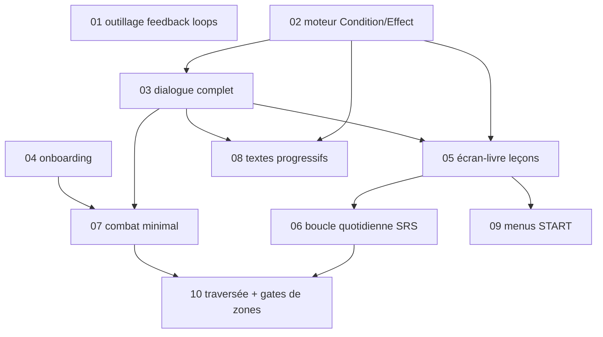

# Kanban — tranche verticale jouable (jalon 1 : Bourg Geon → Route 30)

Créé 2026-07-29 (Phase 4 — découpage du PRD en issues). Objectif du jalon 1 : le parcours
A1 du plan de revue (`.scratch/kanji-no-niwa/plan-revue-direction-2026-07-24.md`) jouable
sur téléphone en paysage — onboarding → choix compagnon → leçons d'Elm → Route 29 →
Ville Griotte → Route 30 → retour (Silver #1) → leçons 3-5 → boucle quotidienne SRS.
Ensuite : QA humaine (phase 6), corrections, puis passage à l'échelle (zones suivantes,
modes de combat restants).

## Le DAG

Vagues parallélisables :
1. **01, 02, 04** (indépendantes)
2. **03** (dès 02)
3. **05, 07, 08** (en parallèle)
4. **06, 09**
5. **10** (l'intégration finale, valide le parcours A1 complet)

## Décisions d'architecture posées pour ce jalon (à re-confirmer à l'échelle)

- **Contenu servi depuis les fichiers `content/` et `src/data/`, côté serveur** — pas
  d'ingestion en base Neon pour ce jalon. Le PRD (§ Pipeline) vise « tout en base » ; pour
  la tranche, lire les JSON versionnés est plus simple, diffable, et l'ingestion Neon
  reste possible plus tard sans changer les types. Neon ne porte que la **progression
  joueur**. Si confirmé à l'échelle → écrire un ADR.
- **Tables de progression : suivre les noms du PRD § Schéma** pour tout ce qui est
  nouveau (`user_map_state`, `npc_quest_progress`, `daily_status`…). Les tables
  existantes `cards`/`reviews` sont étendues plutôt que renommées (issue 05).
- **9 modes de combat maximum au jalon 1, 4-5 réellement implémentés** (Sens, Lecture,
  Saisie, Composition, Grammaire-QCM) — les gardes d'exclusion + redistribution du PRD
  rendent les modes manquants invisibles pour le joueur. Les 13 additionnels attendent
  (décision D4 du plan de revue).
- **TDD non négociable** (phase 5) : chaque issue liste ses boucles de feedback ; la
  logique moteur est en fonctions pures testées avant l'UI.

## Références transverses (à lire par tout agent d'implémentation)

- `CONTEXT.md` — glossaire de domaine faisant autorité (Condition, Effect, State Rule,
  Sight Cone, Roadblock NPC, Book Screen, Kanji Budget…)
- `content/engine-contract.md` — ce que le contenu attend du moteur sans l'écrire
- `docs/adr/0001..0005` — modèles actés (dialogue states, Condition/Effect, Neon+Auth.js)
- `.scratch/kanji-no-niwa/PRD.md` — le PRD qui fait foi
- `.scratch/audits/roadmap-pre-code.md` — historique des étapes 1-4

## Issues hors jalon (déjà ouvertes ailleurs)

`.scratch/verif-systemes-2026-07-24/issues/` : 04 (plafond mots/jour), 05 (couverture
2136), 06 (rétention grammaire hors SRS) — toutes `ready-for-human`, elles calibrent le
SRS/contenu et ne bloquent pas la construction du moteur. La 06 pourrait ajouter un
canal SRS grammaire plus tard ; le moteur SRS de l'issue 06 ci-dessous doit juste ne pas
rendre ça impossible (types `item_type` extensibles).
